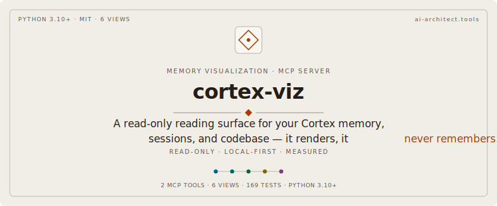
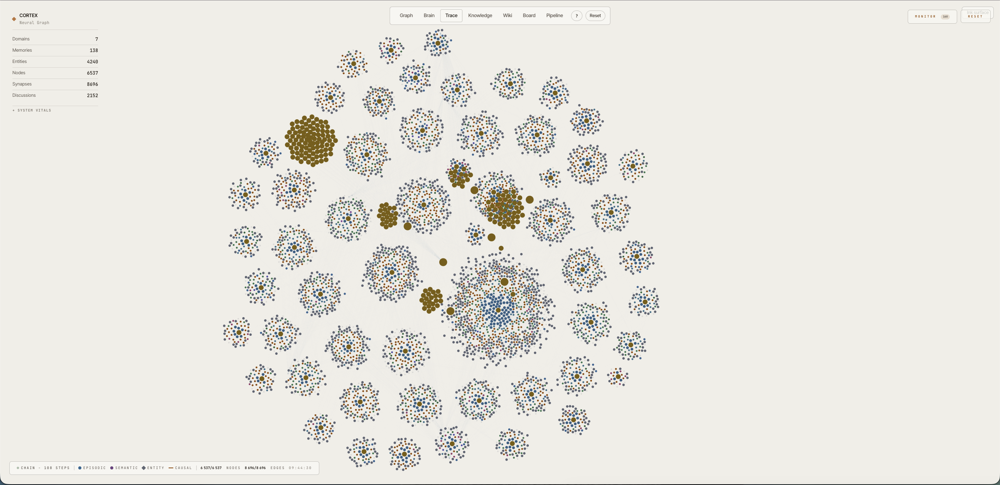
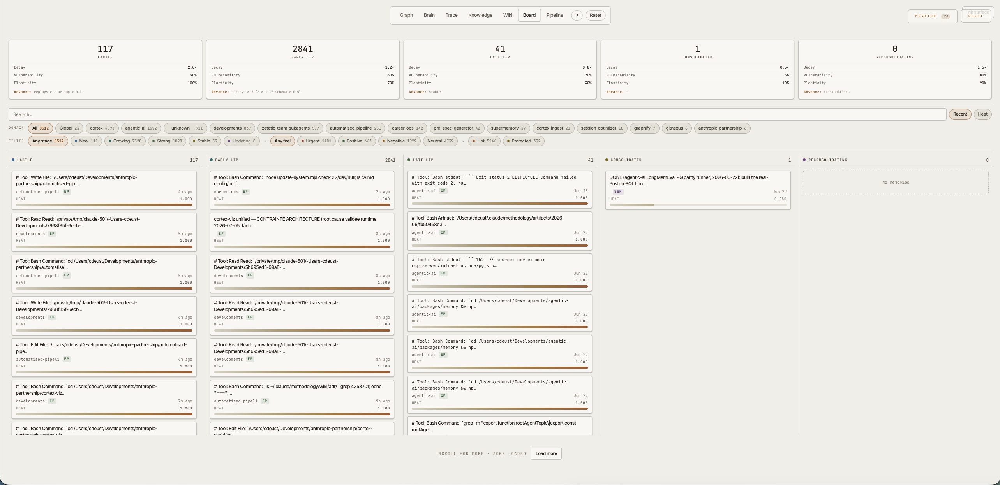
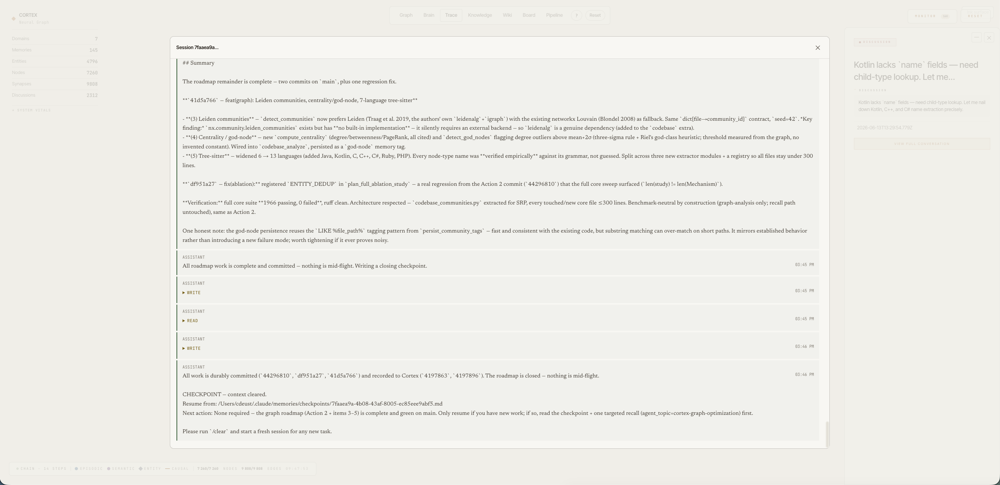
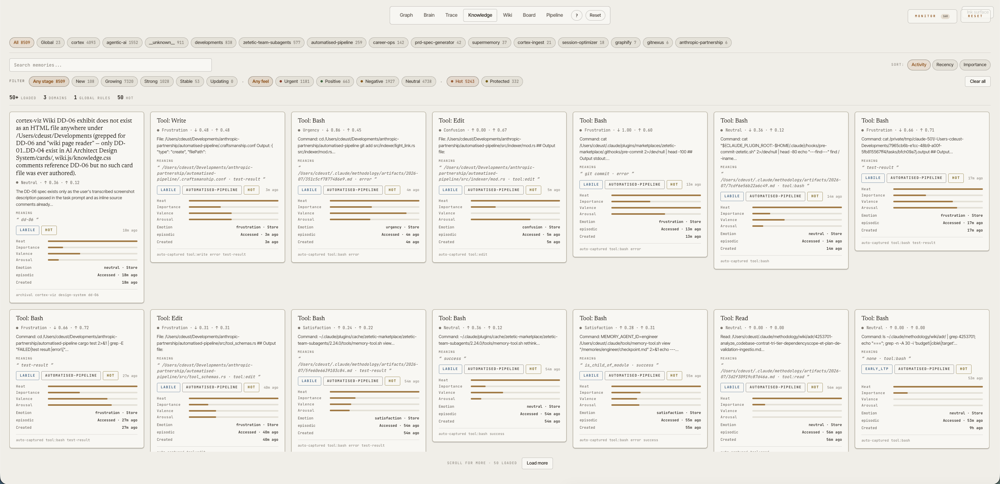
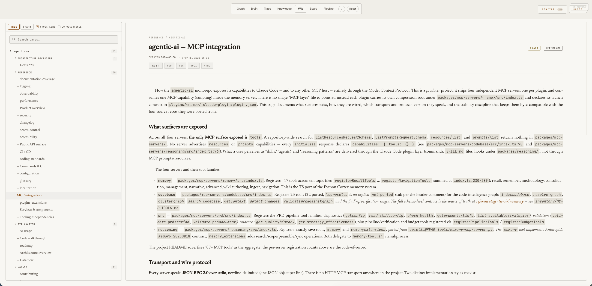

<p align="center">
  
</p>

<p align="center">
  
</p>

<p align="center">
  
  
  
  
</p>

# cortex-viz

**The visualization layer for [Cortex](https://github.com/cdeust/Cortex).** A standalone MCP that turns Cortex's memory store, your Claude Code session history, and your codebase graph into six live reading angles over the same data — a galaxy of every project, that same graph rendered inside a 3D anatomical brain, a per-session execution trace, a consolidation kanban, a curated knowledge browser, and a wiki. It reads Cortex's shared PostgreSQL store **read-only** plus the `~/.claude` artifacts; it renders, it never remembers.

Launch with the `open_visualization` tool (or `/cortex-visualize`). One launcher opens six reading angles; the default landing view is **Trace**.

The whole UI ships on the **AI Architect design system**: a paper-first reading surface with a persistent **ink** (night) toggle, greyscale chrome, and a data palette resolved from design tokens at runtime — flipping the surface re-inks every view in place without disturbing a settled layout, and every count on screen is exact and streamed, never rounded.

---

## Getting Started

The plugin marketplace is the supported install path. cortex-viz ships in the same `cortex-plugins` marketplace as Cortex:

```bash
claude plugin marketplace add cdeust/Cortex
claude plugin install cortex-viz
```

> **cortex-viz is a read-only companion to [Cortex](https://github.com/cdeust/Cortex).** Install Cortex first (`claude plugin install cortex`) — cortex-viz reads its shared PostgreSQL store and never writes to it. Point both at the same database: the `database_url` plugin setting defaults to `postgresql://127.0.0.1:5432/cortex`; set it to the same value you gave Cortex.

Restart your Claude Code session, then launch the visualizer:

```
/cortex-visualize
```

One launcher opens all six reading angles (Graph · Brain · Trace · Knowledge · Wiki · Board) in the browser, served live from the Cortex store, your session JSONL, the code graph, and git.

### Works without Cortex

No Cortex, no PostgreSQL, no setup — cortex-viz is still useful on its own. The **Trace** view (the default landing view) reads only `~/.claude/projects/*.jsonl` and your local git: every Claude Code session becomes a navigable domain → session → prompt → action → file chain, with per-file diffs and commit history. If you use Claude Code, the data is already on your disk.

- Just install the plugin and run `/cortex-visualize`. When Cortex's database isn't reachable, the server logs one line and starts in **no-DB mode** automatically: Trace is fully live; the five DB-backed views (Graph, Brain, Knowledge, Wiki, Board) appear greyed out with an install pointer instead of erroring.
- To skip the database probe entirely, set `CORTEX_VIZ_NO_DB=1` (or pass `--no-db` when running the standalone server directly).

Installing [Cortex](https://github.com/cdeust/Cortex) later lights up the other five views against the same UI — no reconfiguration.

<details>
<summary><strong>More options</strong> (Clone, manual run)</summary>

**Clone + run from source:**
```bash
git clone https://github.com/cdeust/cortex-viz.git && cd cortex-viz
pip install -e .
DATABASE_URL=postgresql://127.0.0.1:5432/cortex python3 -m cortex_viz
# Without Cortex/Postgres (Trace view only):
CORTEX_VIZ_NO_DB=1 python3 -m cortex_viz
```

</details>

---

## The views

### Graph — the Claude workflow map

Each project becomes a **cloud of nodes** around one gold domain hub. Inside every cloud, nodes sit in six concentric levels by the Claude surface (or the code itself) that produced them:

| Level | What's there | Click through to |
|---|---|---|
| **L1 · Setup** | Skills · Commands · Hooks · Agents · MCPs | File paths; which domains share an MCP (thin indigo bridges) |
| **L2 · Tools** | One hub per Claude tool per domain (Edit · Write · Read · Grep · Glob · Bash · Task) | Files touched + total uses |
| **L3 · Files** | Every file Claude opened, read, edited, searched, or referenced — colored by primary tool | `first_seen` / `last_accessed` / `last_modified` + **See diff against HEAD** |
| **L4 · Discussions** | One node per Claude Code session | `started_at`, duration, message count + **View full conversation** replay |
| **L5 · Memories** | Persistent memories, colored by consolidation stage | Full content, tags, every scientific measurement |
| **L6 · AST symbols** | The code itself — functions, methods, classes, modules, constants parsed from 10 languages (Rust, Python, TypeScript, Java, Kotlin, Swift, Objective-C, C, C++, Go) | Qualified name, symbol type, parent file, and named `defined_in` / `calls` / `imports` / `member_of` edges |

**Why L6 matters.** L5 and below tell you *what Claude did*; L6 tells you *what the code is*. Three things become visible for free: **shared code** (any symbol referenced by two projects drifts into the inter-project gap), **impact** (clicking a symbol surfaces every caller, importer, and member — "what breaks if I change this?" is a graph neighbourhood, not a grep), and **the shape of the codebase itself** (a dense petal around a file means a fat internal API; a thin one means a leaf module). A grouped filter (`L1–L6` / by kind / by AST edge kind / `Cross-domain`) isolates any slice.

### Brain — the galaxy inside a real cortex

The same graph, on a second surface: every node placed inside an anatomical **cortical mesh** by the neuroscience of memory systems rather than by force-direction. Episodic memories sit in the **medial temporal lobe** and migrate outward to neocortex along a hot→consolidated **depth gradient** (the complementary-learning-systems consolidation model); semantic entities in **temporal neocortex**; code symbols in association cortex; procedural skills in the **striatum and cerebellum**; domains at the connectome's **rich-club hubs**. Region centres are registered from real **MNI152 atlas** coordinates (affine fit, not vertex-exact — the mesh is a single unlabeled surface). Every synapse routes along a major **white-matter tract** (fornix, uncinate, SLF, corpus callosum). Node colour is the same semantic palette as the galaxy — memories by consolidation stage, entities/symbols by type — and a live **Memory science** panel mirrors the store's system vitals (consolidation pipeline, skills, source-monitoring, extinction, sleep phases, and every mechanism Cortex exposes).

Because the full graph (278k+ nodes, 5.5M edges) is far larger than a browser can take in one payload, the brain **streams** it in progressively through a bounded-queue, frame-budgeted NDJSON loader — the cloud fills in as you watch. Clicking any node opens the same rich detail card as the galaxy (content, tags, live heat, relations, git diff, impact). Open it from the **Brain** button in the view bar, directly at `/brain`, or programmatically via `open_visualization(view="brain")`.

<p align="center">

</p>

<p align="center">

</p>

### Board — consolidation as a kanban

Five columns by consolidation stage (`labile` · `early_ltp` · `late_ltp` · `consolidated` · `reconsolidating`). Each header states the stage's live count (server-side truth, not the loaded page) above its reference stage physics — decay ×, vulnerability %, plasticity % — and the stage's advancement rule (e.g. `replays ≥ 1 or imp > 0.3` at `labile`, `replays ≥ 3` at `early_ltp`). Those physics rows and advance rules are constants from the DD-02 stage spec, not per-bucket medians recomputed live. Cards carry live heat, importance, surprise, valence, arousal, and the exact tool that created the memory.

**Detail panel — every measurement explained.** Clicking any node opens a panel with the raw value *and* a one-line plain-language explanation. Consolidation stage, activity (heat), importance, surprise, emotional tone and intensity, confidence, plasticity, stability — each a labeled bar with a sentence like *"How unexpected this memory was when it arrived. Surprises stick better than routine events."*

<p align="center">

</p>

### Trace · Knowledge · Wiki

- **Trace** *(default)* — the live execution-trace drill: collapsed domain hubs → sessions → the ordered prompt → action → file chain of what actually happened → a file's AST symbols, impact neighbourhood, and git history. Discussions and Cortex `remember`/`recall` ops are woven into the chain. Served live from session JSONL, the code graph, and git on every request — no snapshots, always current.
- **Knowledge** — curated memory cards with the feeling (word + signed valence/arousal, never colour alone), the MEANING line and verbatim excerpt, stage/domain/HOT badges, and four measured meters in fixed order (heat · importance · valence · arousal — a zero shows an empty track, never hides); filter by domain, stage, or feeling with exact facet counts.
- **Wiki** — the per-project knowledge base as a browsable Project → Kind → Pages tree with a dossier-style page reader: serif prose with numbered section heads and mono identifier chips, boxed status and kind badges, dated provenance, and an Edit · PDF · TEX · DOCX · HTML export strip. A CodeMirror split-pane editor with live preview sits behind Edit. (The wiki *content* is authored autonomously by [Cortex](https://github.com/cdeust/Cortex#the-autonomous-wiki); cortex-viz is its reading + editing surface.)

<p align="center">

</p>

<p align="center">

</p>

---

## Install

cortex-viz is a Claude Code plugin (and a plain MCP server). Point it at the **same database as your Cortex install** — it reads that store read-only.

**As a plugin** — ships the MCP server, the `/cortex-visualize` skill, and the live session-activity hooks. The bundled `scripts/launcher.py` bootstraps its own dependencies on first launch (no manual `pip` needed). Configure the DB via the plugin's `database_url` user-config (defaults to `postgresql://127.0.0.1:5432/cortex`).

**As a raw MCP / for development:**

```bash
pip install -e ".[data,viz-tile]"   # data = PG read path; viz-tile = igraph/datashader tiles (optional)
cortex-viz                          # or: python -m cortex_viz   (stdio MCP transport)
```

Set `DATABASE_URL` to the shared Cortex database. `open_visualization` launches the galaxy UI in the browser, bound to `127.0.0.1`.

**Other MCP hosts.** Any MCP host can launch the server — it is a plain stdio process. From a clone after `pip install -e .`, register `{"command": "python3", "args": ["-m", "cortex_viz"]}` in your host's MCP config (Gemini CLI `~/.gemini/settings.json`, Cursor `.cursor/mcp.json`, Windsurf `~/.codeium/windsurf/mcp_config.json`, VS Code `.vscode/mcp.json` under `"servers"`, or Codex CLI: `codex mcp add cortex-viz -- python3 -m cortex_viz`) and the `open_visualization` tool opens the UI in the browser. Be clear about what you'll see: the **Trace** view reads Claude Code session JSONLs under `~/.claude/projects/` — it is Claude-data-specific and stays empty if you don't use Claude Code — and the galaxy/brain/knowledge/wiki/board views need a [Cortex](https://github.com/cdeust/Cortex) store to read. On a non-Claude host, cortex-viz is only useful as a viewer over data those two produce.

## Boundary

cortex-viz consumes Cortex's **artifacts on disk + PostgreSQL**, never Cortex's live Python objects:

| Data | Source |
|---|---|
| Memories, entities, relationships (graph nodes) | Cortex PG store (shared `DATABASE_URL`), read-only via `MemoryReader` |
| Wiki pages + thermodynamic state | `~/.claude/methodology/wiki/` + the `wiki.*` PG schema |
| Sessions / execution traces | `~/.claude/projects/*.jsonl` |
| Cognitive profiles | `~/.claude/methodology/profiles.json` |
| Codebase graph (AST symbols, impact) | [`automatised-pipeline`](https://github.com/cdeust/ai-automatised-pipeline) MCP (stdio) |
| PRD document/section nodes | [`prd-spec-generator`](https://github.com/cdeust/ai-prd-generator) MCP + on-disk artifacts |

No `import mcp_server.*` is permitted anywhere in `cortex_viz/` — that invariant is the extraction's correctness check.

## MCP tools

`open_visualization` (launch the browser UI — pass `view="brain"` for the 3D anatomical brain, `view="galaxy"` or omit for the 2D graph) and `get_methodology_graph` (graph data). The six views are served over HTTP by the server `open_visualization` launches; a live session-activity stream (every tool call, MCP call, file access, skill, and command) feeds the graph in real time via the activity-capture hooks.

## Status

The visualization stack was extracted from Cortex (which is now a focused memory engine) so the graphics ship and scale on their own. Standalone MCP boots over stdio; all six views are bridged to live data; the galaxy builds end-to-end at 75k+ nodes; the 3D brain streams the full graph into a cortical mesh; the whole UI sits on the AI Architect design system (paper/ink surfaces, token-resolved palette); the suite passes.
