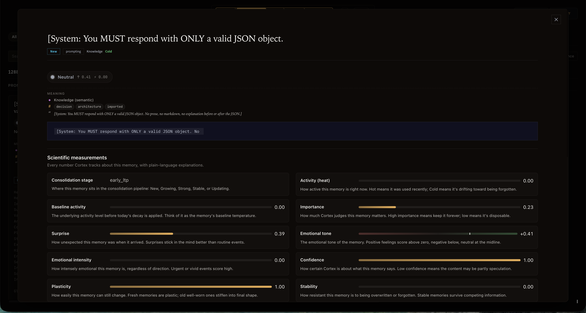
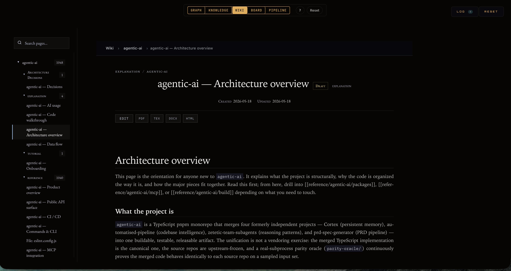

<p align="center">
  
</p>

<p align="center">
  
  
  
</p>

# cortex-viz

**The visualization layer for [Cortex](https://github.com/cdeust/Cortex).** A standalone MCP that turns Cortex's memory store, your Claude Code session history, and your codebase graph into six live reading angles over the same data — a galaxy of every project, a per-session execution trace, a consolidation kanban, a curated knowledge browser, and a wiki. It reads Cortex's shared PostgreSQL store **read-only** plus the `~/.claude` artifacts; it renders, it never remembers.

Launch with the `open_visualization` tool (or `/cortex-visualize`). One launcher opens six reading angles; the default landing view is **Trace**.

---

## The views

### Graph — the Claude workflow map

Each project becomes a **cloud of nodes** around one gold domain hub. Inside every cloud, nodes sit in six concentric levels by the Claude surface (or the code itself) that produced them:

| Level | What's there | Click through to |
|---|---|---|
| **L1 · Setup** | Skills · Commands · Hooks · Agents · MCPs | File paths; which domains share an MCP (thin indigo bridges) |
| **L2 · Tools** | One hub per Claude tool per domain (Edit · Write · Read · Grep · Glob · Bash · Task) | Files touched + total uses |
| **L3 · Files** | Every file Claude opened, read, edited, searched, or referenced — colored by primary tool | `first_seen` / `last_accessed` / `last_modified` + **See diff against HEAD** |
| **L4 · Discussions** | One node per Claude Code session | `started_at`, duration, message count + **View full conversation** replay |
| **L5 · Memories** | Persistent memories, colored by consolidation stage | Full content, tags, every scientific measurement |
| **L6 · AST symbols** | The code itself — functions, methods, classes, modules, constants parsed from 10 languages (Rust, Python, TypeScript, Java, Kotlin, Swift, Objective-C, C, C++, Go) | Qualified name, symbol type, parent file, and named `defined_in` / `calls` / `imports` / `member_of` edges |

**Why L6 matters.** L5 and below tell you *what Claude did*; L6 tells you *what the code is*. Three things become visible for free: **shared code** (any symbol referenced by two projects drifts into the inter-project gap), **impact** (clicking a symbol surfaces every caller, importer, and member — "what breaks if I change this?" is a graph neighbourhood, not a grep), and **the shape of the codebase itself** (a dense petal around a file means a fat internal API; a thin one means a leaf module). A grouped filter (`L1–L6` / by kind / by AST edge kind / `Cross-domain`) isolates any slice.

<p align="center">

</p>

### Board — consolidation as a kanban

Five columns by consolidation stage (`labile` · `early_ltp` · `late_ltp` · `consolidated` · `reconsolidating`). Each header reads live bucket metrics — decay rate, vulnerability, plasticity, heat / importance / encoding / interference medians, hippocampal dependency, replay count — with the advancement rule (`replay ≥ 3`, `DA ≥ 1 or imp > 0.3`) printed under the bar. Cards carry heat, importance, surprise, valence, arousal, and the exact tool that created the memory.

<p align="center">

</p>

**Detail panel — every measurement explained.** Clicking any node opens a panel with the raw value *and* a one-line plain-language explanation. Consolidation stage, activity (heat), importance, surprise, emotional tone and intensity, confidence, plasticity, stability — each a labeled bar with a sentence like *"How unexpected this memory was when it arrived. Surprises stick better than routine events."*

### Trace · Knowledge · Wiki · Pipeline

- **Trace** *(default)* — the live execution-trace drill: collapsed domain hubs → sessions → the ordered prompt → action → file chain of what actually happened → a file's AST symbols, impact neighbourhood, and git history. Discussions and Cortex `remember`/`recall` ops are woven into the chain. Served live from session JSONL, the code graph, and git on every request — no snapshots, always current.
- **Knowledge** — curated memory cards with heat-based borders, emotion tags, and evidence file references; filter by domain or emotion, click any card for a full detail panel.
- **Wiki** — the per-project knowledge base as a browsable Project → Kind → Pages tree, with a coverage grid on the welcome screen, and a CodeMirror split-pane editor with live preview. (The wiki *content* is authored autonomously by [Cortex](https://github.com/cdeust/Cortex#the-autonomous-wiki); cortex-viz is its reading + editing surface.)
- **Pipeline** — a horizontal Sankey from domains through the write gate into consolidation stages; ribbon width = memory volume, so retention and drop-off are visible at a glance.

<p align="center">

</p>

<p align="center">

</p>

---

## Install

cortex-viz is a Claude Code plugin (and a plain MCP server). Point it at the **same database as your Cortex install** — it reads that store read-only.

**As a plugin** — ships the MCP server, the `/cortex-visualize` skill, and the live session-activity hooks. The bundled `scripts/launcher.py` bootstraps its own dependencies on first launch (no manual `pip` needed). Configure the DB via the plugin's `database_url` user-config (defaults to `postgresql://127.0.0.1:5432/cortex`).

**As a raw MCP / for development:**

```bash
pip install -e ".[data,viz-tile]"   # data = PG read path; viz-tile = igraph/datashader tiles (optional)
cortex-viz                          # or: python -m cortex_viz   (stdio MCP transport)
```

Set `DATABASE_URL` to the shared Cortex database. `open_visualization` launches the galaxy UI in the browser, bound to `127.0.0.1`.

## Boundary

cortex-viz consumes Cortex's **artifacts on disk + PostgreSQL**, never Cortex's live Python objects:

| Data | Source |
|---|---|
| Memories, entities, relationships (graph nodes) | Cortex PG store (shared `DATABASE_URL`), read-only via `MemoryReader` |
| Wiki pages + thermodynamic state | `~/.claude/methodology/wiki/` + the `wiki.*` PG schema |
| Sessions / execution traces | `~/.claude/projects/*.jsonl` |
| Cognitive profiles | `~/.claude/methodology/profiles.json` |
| Codebase graph (AST symbols, impact) | [`automatised-pipeline`](https://github.com/cdeust/ai-automatised-pipeline) MCP (stdio) |
| PRD document/section nodes | [`prd-spec-generator`](https://github.com/cdeust/ai-prd-generator) MCP + on-disk artifacts |

No `import mcp_server.*` is permitted anywhere in `cortex_viz/` — that invariant is the extraction's correctness check.

## MCP tools

`open_visualization` (launch the browser UI) and `get_methodology_graph` (graph data). The six views are served over HTTP by the server `open_visualization` launches; a live session-activity stream (every tool call, MCP call, file access, skill, and command) feeds the graph in real time via the activity-capture hooks.

## Status

The visualization stack was extracted from Cortex (which is now a focused memory engine) so the graphics ship and scale on their own. Standalone MCP boots over stdio; all six views are bridged to live data; the galaxy builds end-to-end at 75k+ nodes; the suite passes.
